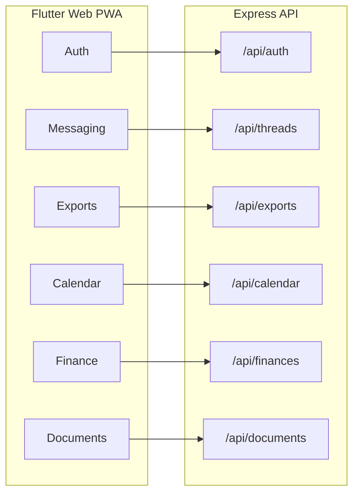
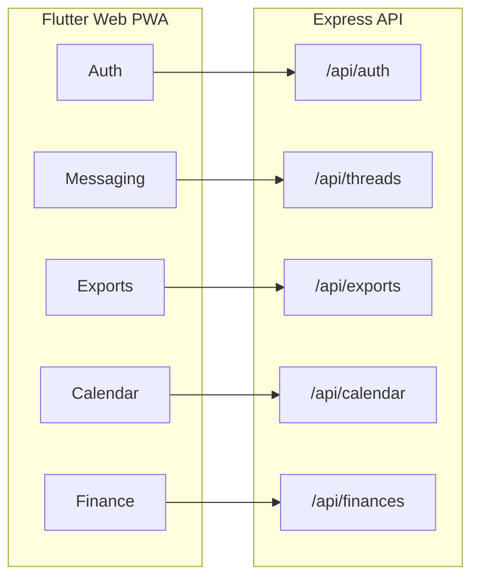

# Coparentes — Full Codebase Audit & Repair Plan

## Progress log

| Critical item | Status | Verification |
|---------------|--------|--------------|
| 1. Backend env vars | **Done** | `npm run check:env`, `npm run smoke:health` |
| 2. Frontend API URL | **Done** | Railway `/health` OK; Render stale; docs aligned |
| 3. Missing calendar/finance routes | **Done** | Contract tests: 401 (mounted) |
| 4. Sample-data fallback | **Done** | Removed from `main.dart` live mode |
| 5. DB migrations | **Done** | Migration `20260526_calendar_finances`; run `npm run db:up && npm run db:migrate` |
| 6. CORS | **Done** | Custom middleware + Netlify/coparentes.ai patterns; `npm run smoke:cors` |
| 7. Workspace children API | **Done** | `POST /api/workspace/children` (parentA); E2E onboarding step |
| 8. Export payloads | **Done** | calendar/finances/fullPack items populated with date filters |
| 9. Documents MVP | **Done** | `GET/POST /api/documents`; Flutter vault wired |
| 10. Profile/settings API | **Done** | `PATCH /api/auth/profile`, `POST /api/auth/password` |
| 11. Email invite UI | **Done** | Settings sheet → `POST /api/invite/send`, `GET /api/invite/sent` |
| 12. Remediation FIX-001–047 | **Done** | Security, offline sync, RBAC, export TTL, tests — see git history |

**Current completion estimate: ~70%** toward production-ready. Calendar, finance, documents, exports, and profile APIs are integrated. Remaining: full 2FA (FIX-043 roadmap), production hardening, and expanded E2E coverage.



---# App Overview

**Coparentes** is a Polish-first co-parenting platform for separated parents: shared workspace, role-based dashboards (Parent A/B, Child, Observer), messaging with tone tracking, custody calendar, expense splitting, evidence exports (SHA-256 manifests), and AI Coach/Shield UX (currently client-side heuristics only).

| Layer | Stack |
|-------|-------|
| Backend | Node.js 20+, Express 4, Prisma 6, PostgreSQL, Bearer session tokens (not JWT), bcrypt, Zod, Resend (optional) |
| Frontend | Flutter Web/PWA (Dart 3+), Provider, `http` REST client, SharedPreferences offline cache |
| Communication | REST JSON over HTTPS; `Authorization: Bearer <token>`; base URL ends with `/api` |
| Auth | Register workspace → join via invite code → login; session stored in `Session` table |

**Current completion estimate: ~70%** toward a production-ready, fully integrated app. Demo mode and live API paths are wired for auth, messaging, calendar, finance, documents, exports, and settings.



---

# Critical — App won't run without these

### 1. Backend required environment variables
**File:** [`coparentes-backend-main/src/utils/env.js`](/Users/kingastaszewska/Desktop/coparentes-backend-main/src/utils/env.js), [`.env.example`](/Users/kingastaszewska/Desktop/coparentes-backend-main/.env.example)

| Variable | Required | Problem if missing | Fix |
|----------|----------|-------------------|-----|
| `DATABASE_URL` | **Yes** | Server throws at startup | Provision PostgreSQL; set connection string |
| `FRONTEND_URL` | **Yes** | Server throws at startup | Set to deployed Flutter origin (e.g. `https://your-app.netlify.app`) |
| `CORS_ORIGINS` | Recommended | Browser blocks API calls from frontend | Comma-list including frontend URL(s) |
| `PUBLIC_BASE_URL` | Recommended in prod | Export `downloadUrl` is relative path | Set to API origin (e.g. `https://api.example.com`) |
| `PORT` | No (default 3000) | — | Set on host |
| `NODE_ENV` | No | — | `production` in deploy |
| `SESSION_TTL_DAYS` | No | — | Default 30 |
| `SEED_DEMO_DATA` | No | — | `true` locally, `false` in prod |
| `RESEND_API_KEY` / `RESEND_FROM_EMAIL` | No | Email invites silently skipped | Set if using `/api/invite` |
| `INVITE_EXPIRES_DAYS` | No | — | Default 7 |

**Exact local fix:**
```bash
cd coparentes-backend-main
cp .env.example .env
# Edit DATABASE_URL, FRONTEND_URL, CORS_ORIGINS, PUBLIC_BASE_URL
npm install && npm run db:migrate
SEED_DEMO_DATA=true npm run dev
```

### 2. Frontend build/deploy env
**File:** [`Coparentes-App-vol-2-main/lib/config/app_environment.dart`](/Users/kingastaszewska/Desktop/Coparentes-App-vol-2-main/lib/config/app_environment.dart)

| Variable | Required | Problem | Fix |
|----------|----------|---------|-----|
| `COPARENTES_API_BASE_URL` | **Yes for Netlify** | Build fails ([`scripts/netlify-build.sh`](/Users/kingastaszewska/Desktop/Coparentes-App-vol-2-main/scripts/netlify-build.sh)) | Set HTTPS URL ending in `/api` |

**URL mismatch blocker:** Code default is `https://coparentes-backend-production.up.railway.app/api` but README says `https://coparentes-backend.onrender.com/api`. One may be stale/dead — verify which deployment is live and align both repos.

### 3. Missing backend routes called by frontend (404)
**Files:** [`calendar_repository.dart`](/Users/kingastaszewska/Desktop/Coparentes-App-vol-2-main/lib/data/repositories/calendar_repository.dart), [`finance_repository.dart`](/Users/kingastaszewska/Desktop/Coparentes-App-vol-2-main/lib/data/repositories/finance_repository.dart), [`createApp.js`](/Users/kingastaszewska/Desktop/coparentes-backend-main/src/createApp.js)

| Frontend call | Backend status |
|---------------|----------------|
| `GET /api/calendar` | **Missing** |
| `POST /api/calendar/swaps/:swapId/respond` | **Missing** |
| `GET /api/finances/expenses` | **Missing** |
| `POST /api/finances/expenses` | **Missing** |
| `POST /api/finances/expenses/:id/status` | **Missing** |

**Fix:** Add Prisma models + routes + services (detailed in Implementation order below).

### 4. Sample-data fallback masks API failures
**File:** [`Coparentes-App-vol-2-main/lib/main.dart`](/Users/kingastaszewska/Desktop/Coparentes-App-vol-2-main/lib/main.dart) lines 231–236

After failed calendar/finance API calls (404), app injects Polish demo data via `initializeSampleData()`, making the app look functional while showing fake data.

**Fix:** Remove automatic sample-data fallback in live (non-demo) mode; show error states instead. Keep sample data only for explicit demo mode.

### 5. Database migrations must run before first boot
**Files:** [`prisma/migrations/`](/Users/kingastaszewska/Desktop/coparentes-backend-main/prisma/migrations/), [`Dockerfile`](/Users/kingastaszewska/Desktop/coparentes-backend-main/Dockerfile)

**Fix:** Run `npm run db:migrate` locally; ensure deploy runs `prisma migrate deploy` (already in Dockerfile/Procfile).

### 6. CORS misconfiguration
**File:** [`createApp.js`](/Users/kingastaszewska/Desktop/coparentes-backend-main/src/createApp.js)

If `CORS_ORIGINS` / `FRONTEND_URL` don't match the Flutter web origin, auth and all API calls fail in browser.

**Fix:** Set `CORS_ORIGINS=https://your-netlify-app.netlify.app` (and localhost for dev).

---

# Important — App runs but key features are broken or missing

## Auth
| What's missing (frontend) | What's missing (backend) | Build needed |
|---------------------------|--------------------------|--------------|
| 2FA toggle shows info dialog only | `twoFactorEnabled` set on register but no verification flow | Real 2FA or remove flag |
| Profile edit, PIN change → SnackBar stubs | No `PATCH /api/auth/profile` or password endpoints | Profile/password API + settings wiring |
| Email invite UI absent | `/api/invite/send`, `/accept`, `/partnership` exist but unused | Invite UI or defer |

**Works today:** Login, register, join, session restore, logout, role routing.

## Messaging
| Frontend gap | Backend gap |
|--------------|-------------|
| Attach button `onPressed: () {}` | `attachments: []` always in serializer |
| No mark-as-read UI | `isRead` stored but no update endpoint |
| — | `childId` on thread create not validated against workspace children |

**Works today:** List threads, create thread, send message, offline queue sync, tone + hash + `isShielded` derivation.

## Calendar
| Frontend gap | Backend gap |
|--------------|-------------|
| Add event sheet → SnackBar only (no repo method) | Entire `/api/calendar` module missing |
| Create swap sheet → SnackBar only | No `POST /calendar/swaps` |
| Respond to swap **is wired** to API | No swap models/routes |
| Full calendar UI with custody/events/swaps tabs | No Prisma models: `CustodySlot`, `CalendarEvent`, `SwapRequest` |

**Expected API contract** (from [`calendar_serializers.dart`](/Users/kingastaszewska/Desktop/Coparentes-App-vol-2-main/lib/data/serializers/calendar_serializers.dart)):
- `GET /calendar` → `{ custodySlots[], events[], swapRequests[] }`
- `POST /calendar/swaps/:id/respond` → `{ status, responseNote? }` → updated swap object
- (Future) `POST /calendar/events`, `POST /calendar/swaps` for create flows

## Finance
| Frontend gap | Backend gap |
|--------------|-------------|
| OCR labeled "(symulacja)" — 1s fake delay | Entire `/api/finances` module missing |
| PDF export → SnackBar only | No export endpoint |
| Create expense + status update **wired** to API | No Prisma `Expense` model or routes |

**Expected API contract** (from [`finance_serializers.dart`](/Users/kingastaszewska/Desktop/Coparentes-App-vol-2-main/lib/data/serializers/finance_serializers.dart)):
- `GET /finances/expenses` → `{ expenses: [...] }`
- `POST /finances/expenses` → single expense with `hash`
- `POST /finances/expenses/:id/status` → `{ status }` → updated expense

## Exports
| Frontend gap | Backend gap |
|--------------|-------------|
| Works for create/list/download | `calendar` and `finances` export types return **empty `items`** in [`exports.js`](/Users/kingastaszewska/Desktop/coparentes-backend-main/src/services/exports.js) |
| Observer quick export → SnackBar only | — |

**Works today:** `messages` and `fullPack` exports with manifest hash and download payload.

## Documents
| Frontend | Backend |
|----------|---------|
| Static hardcoded list in [`documents_screen.dart`](/Users/kingastaszewska/Desktop/Coparentes-App-vol-2-main/lib/screens/documents/documents_screen.dart) | No document model, storage, or routes |
| Upload → "Upload workflow will be connected next." | — |

## Child dashboard
| Frontend | Backend |
|----------|---------|
| Fully local: schedule, mood, packing, requests (SnackBars) | Child role can join/login but no child-specific API |
| No API integration | No child content endpoints |

## Workspace / children management
| Gap | Impact |
|-----|--------|
| Register creates workspace with **empty `children[]`** | Thread creation UI may reference children that don't exist |
| No `POST /api/workspace/children` or similar | Only seed data adds children |
| `/api/workspace/current` exists | Frontend never calls it (uses auth session payload) |

## AI / security / notifications (marketing vs reality)
| Feature | Status |
|---------|--------|
| AI Coach / AI Shield | Client-side keyword heuristics in [`ai_guidance_service.dart`](/Users/kingastaszewska/Desktop/Coparentes-App-vol-2-main/lib/services/ai_guidance_service.dart) |
| Push notifications | Settings toggles only |
| PIN on resume | Toggle stored in memory only |
| Trusted devices | "Full version" placeholder |

---

# Complete — what already works

- **Auth flow:** register workspace, join via invite code, login, session restore from SharedPreferences, logout, Bearer middleware, rate-limited auth endpoints
- **Role routing:** Parent A/B → `ParentDashboard`, Observer → `ObserverDashboard`, Child → `ChildDashboard`, Demo mode for all roles
- **Messaging:** Full REST integration with offline queue (`MessagingRepository`)
- **Evidence exports (messages):** Create, list, download with SHA-256 manifest hash
- **Offline infrastructure:** `OfflineStore`, pending action queues, health polling every 20s, status banner
- **Demo mode:** Self-contained Polish sample data for calendar/finance/messaging cleared appropriately
- **Backend quality:** Clean Express structure, Zod validation, Prisma migrations (3), contract tests, optional E2E test, Docker/Render deploy config, demo seed (`anna@coparentes.app` / `Coparentes!123`, invite `KOWALSCY2026`)
- **Frontend polish:** Multi-tab dashboards, i18n locales (pl/en/de/fr), theme/color customization, PWA/Netlify pipeline

---

# API cross-reference matrix

### Frontend calls with NO backend
| Area | Endpoints |
|------|-----------|
| Calendar | `GET /calendar`, `POST /calendar/swaps/:id/respond` |
| Finance | `GET /finances/expenses`, `POST /finances/expenses`, `POST /finances/expenses/:id/status` |

### Backend routes with NO frontend (or no body)
| Area | Endpoints | Notes |
|------|-----------|-------|
| Email invites | `POST /api/invite/send`, `POST /api/invite/accept`, `GET /api/invite/partnership` | Backend-only |
| Workspace refresh | `GET /api/workspace/current` | Redundant with auth session |
| Single thread | `GET /api/threads/:threadId` | Frontend loads all threads at once |
| Health extras | `GET /api/health`, `GET /api/ready` | Frontend only pings `/health` |

### UI features with NO backend AND no repository wiring
- Create calendar event
- Create swap request
- Document vault upload/list
- Child dashboard actions
- Settings: profile edit, PIN, trusted devices, notification delivery
- Messaging attachments
- Finance PDF export, real OCR

---

# Implementation order (fastest path to working app)

1. **Environment & deploy alignment** — `.env`, migrate DB, verify live API URL, set `CORS_ORIGINS` + `PUBLIC_BASE_URL`, set Netlify `COPARENTES_API_BASE_URL`
2. **Remove live-mode sample-data fallback** — [`main.dart`](/Users/kingastaszewska/Desktop/Coparentes-App-vol-2-main/lib/main.dart): stop calling `initializeSampleData()` when API fails in non-demo mode
3. **Calendar backend (Phase A — read + respond)** — Prisma models (`CustodySlot`, `CalendarEvent`, `SwapRequest`), migration, `GET /api/calendar`, `POST /api/calendar/swaps/:id/respond`, serializers matching Flutter contract, seed demo calendar data
4. **Finance backend (Phase A — CRUD)** — Prisma `Expense` model, migration, three finance routes, integrity `hash` on create, seed demo expenses
5. **Calendar backend (Phase B — write)** — `POST /api/calendar/events`, `POST /api/calendar/swaps`; wire frontend sheets in [`calendar_screen.dart`](/Users/kingastaszewska/Desktop/Coparentes-App-vol-2-main/lib/screens/calendar/calendar_screen.dart)
6. **Workspace children API** — `POST /api/workspace/children` (parentA only) so new workspaces aren't empty; optional UI in settings/onboarding
7. **Export payload completion** — Populate `calendar`/`finances`/`fullPack` export items from new models in [`exports.js`](/Users/kingastaszewska/Desktop/coparentes-backend-main/src/services/exports.js)
8. **Messaging hardening** — Validate `childId`, add mark-read endpoint, optional attachment schema (defer file storage to Phase 2)
9. **Documents MVP** — Prisma `Document` model + file storage (S3/R2) + `GET/POST /api/documents`; wire [`documents_screen.dart`](/Users/kingastaszewska/Desktop/Coparentes-App-vol-2-main/lib/screens/documents/documents_screen.dart)
10. **Settings/profile API** — `PATCH /api/auth/profile`, password change; wire settings SnackBar stubs
11. **Email invite frontend** — Connect to existing `/api/invite` routes
12. **Child dashboard API** — Child-scoped read endpoints for schedule/requests (lower priority)
13. **AI / PIN / push** — Defer to post-MVP; currently marketing placeholders

### Suggested backend file additions (Phase 3–4)
```
src/routes/calendar.js
src/routes/finances.js
src/services/calendar.js
src/services/finances.js
src/services/serializers.js  (extend)
prisma/schema.prisma           (CustodySlot, CalendarEvent, SwapRequest, Expense)
prisma/migrations/YYYYMMDD_calendar_finances/
```

### Verification checklist after each phase
- `npm test` + `RUN_E2E=true npm run test:e2e` (backend)
- `bash scripts/verify-flutter-api.sh` against running server
- Flutter: login with seed account → calendar/finance load without sample fallback → create expense → respond to swap → export fullPack

---

# Risk notes

- **Hidden failure mode:** Calendar/finance appear to work today because sample data fills empty/error states — fix this before building new APIs or bugs will be hard to spot
- **Deploy URL drift:** Railway vs Render defaults may point frontend at a dead backend
- **No file storage layer:** Attachments, receipts, documents need S3-compatible storage (not in either repo today)
- **Role ACL:** All workspace members have equal access to threads/exports; observer read-only is enforced only in Flutter UI, not backend
- **Email invite security:** Accept endpoint doesn't verify invite email matches logged-in user

---

**Next step after approval:** Write this content to `REPAIR_PLAN.md` in the backend root, then implement section-by-section starting with Critical items 1–6.
